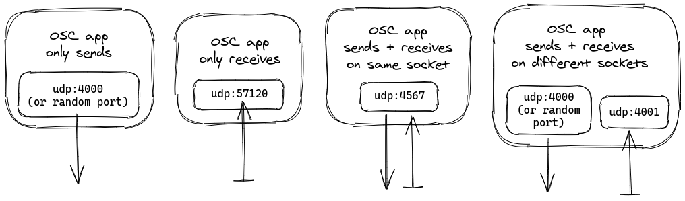

# browserglue


Exposes OSC connections to the browser through WebSockets.

*Work in progress, design and interface may change frequently*

## Features

* Send messages from local OSC applications to different channels.
* Publish messages to channels and broadcast them to multiple OSC application on your machine.
* Portable cross-platform executable that acts as the Server.
* Server can be controlled remotely from clients (Browser or Node.js library).

## Development

After cloning repository, install dependencies with `yarn` or `yarn install` .

You can start a development server by runnig `yarn dev`. It will watch source
files for changes and restart the BrowserGlue binary script automatically.

To create production bundles for the browser and Nodejs, run `yarn build` .
This will generate a `dist/browserglue.js` library for browsers, and
`dist/browserglue.node.js` for Nodejs.

Run `yarn docs` to build documentation.

## Design

### JavaScript API

```javascript
var client = new browserglue.Client();

// Add a channel that will only receive messages on port 5000
client.addChannel("/onlyReceive", 5000).then(channel => {
    channel.on('message', msg => console.log("Message from /onlyReceive:", msg));
});
// this is the same as:
//  client.addChannel("/onlyReceive").then(channel => channel.bindPort(5000));

// Add channel /sendReceive, and bind to port 5000
client.addChannel("/sendReceive", 5000, 5001).then(channel => {
    // Handle messages
    channel.on('message', msg => {
        console.log("Message from /foo", msg);
    });

    // Remove channel after 10 seconds
    setTimeout(async () => {
        channel.remove();

        // Get new list of channels. You can also listen to the "change" event
        const channels = await client.getChannels();
        console.log("Current channels:", channels);
    }, 10000);
});

// Add another channel, this will skip binding to a port and will only send messages to port 6001 and 6002
client.addChannel("/onlySend").then(channel => {
    channel.subscribePort(6001);
    channel.subscribePort(6002);

    // Broadcast a message to subscribed ports (6001 and 6002)
    channel.publish("this is a message");
});

// Get all channels
client.getChannels().then(channels => console.log("Current channels:", channels));

// Listen on any event in the server: change, add-channel, remove-channel,
// bind-port, subscribe-port, unsubscribe-port
client.on("change", event => {
    console.log("[change]", event);
});
```

### OSC Apps Supported Use Cases



### Internals


## Contributing

Bug reports and pull requests are welcome on GitHub at the [issues
page](https://github.com/munshkr/browserglue). This project is intended to be a
safe, welcoming space for collaboration, and contributors are expected to
adhere to the [Contributor Covenant](http://contributor-covenant.org) code of
conduct.

## License

This project is licensed under AGPL 3+. Refer to [LICENSE.txt](LICENSE.txt).
