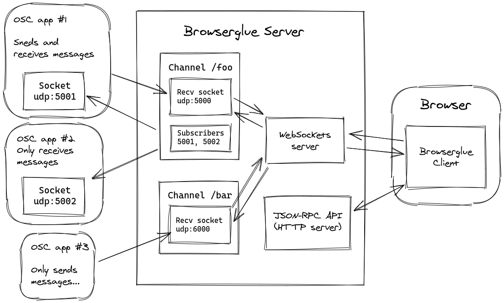

# browserglue


Exposes OSC connections to the browser through WebSockets.

*Work in progress, design and interface may change frequently*

## Features

* Send messages from local OSC applications to different channels.
* Publish messages to channels and broadcast them to multiple OSC application on your machine.
* Portable cross-platform executable that acts as the Server.
* Server can be controlled remotely from clients (Browser or Node.js library).

## Development

After cloning repository, install dependencies with `yarn` or `yarn install` .

You can start a development server by runnig `yarn dev`. It will watch source
files for changes and restart the BrowserGlue binary script automatically.

To create production bundles for the browser and Nodejs, run `yarn build` .
This will generate a `dist/browserglue.js` library for browsers, and
`dist/browserglue.node.js` for Nodejs.

Run `yarn docs` to build documentation.

## Design

### JavaScript API

```javascript
(async () => {
    window.bg = new browserglue.Client();

    // Subscribe to all server events
    bg.on('connect', (msg => console.log("[connect]", msg)));
    bg.on('disconnect', (msg => console.log("[disconnect]", msg)));
    bg.on('change', (msg => console.log("[change]", msg)));
    bg.on('add-channel', (msg => console.log("[add-channel]", msg)));
    bg.on('remove-channel', (msg => console.log("[remove-channel]", msg)));
    bg.on('bind-port', (msg => console.log("[bind-port]", msg)));
    bg.on('subscribe-port', (msg => console.log("[subscribe-port]", msg)));
    bg.on('unsubscribe-port', (msg => console.log("[unsubscribe-port]", msg)));

    console.log("Remove all channels first");
    await bg.removeAllChannels();

    console.log("Add channel /foo binded to udp:4000")
    const channel = await bg.addChannel("/foo", 4000);
    // Handle messages
    channel.on('message', async blob => {
	const text = await blob.text();
	console.log("[/foo]", text);
    });

    // Remove channel after 3 seconds
    console.log("Remove channel /foo in 3 seconds...");
    setTimeout(async () => {
	console.log("Remove channel /foo");
	channel.remove();
	console.log("Current channels:", bg.channels);
    }, 3000);

    // Add another channel
    console.log("Add channel /bar binded to udp:5000");
    const barChannel = await bg.addChannel("/bar", 5000);
    console.log("Subscribe port 5010 on /bar");
    barChannel.subscribePort(5010);
    console.log("Subscribe port 5011 on /bar");
    barChannel.subscribePort(5011);
    // Handle messages
    barChannel.on('message', async blob => {
	const text = await blob.text();
	console.log("[/bar]", text);
    });

    // Remove channel after 3 seconds
    setTimeout(async () => {
	console.log("Unsubscribe port 5010 on channel /bar");
	barChannel.unsubscribePort(5010);
	console.log("/bar Channel instance:", barChannel);
    }, 500);

    // List all channels
    console.log("Current channels:", bg.channels);

    setInterval(() => {
	const now = new Date();
	const msg = `this message was sent at ${now.toISOString()}`;
	console.log("Publish to /bar:", msg);
	barChannel.publish(msg);
    }, 3000);
})();
```

### OSC Apps Supported Use Cases


### Internals



## Contributing

Bug reports and pull requests are welcome on GitHub at the [issues
page](https://github.com/munshkr/browserglue). This project is intended to be a
safe, welcoming space for collaboration, and contributors are expected to
adhere to the [Contributor Covenant](http://contributor-covenant.org) code of
conduct.

## License

This project is licensed under AGPL 3+. Refer to [LICENSE.txt](LICENSE.txt).
